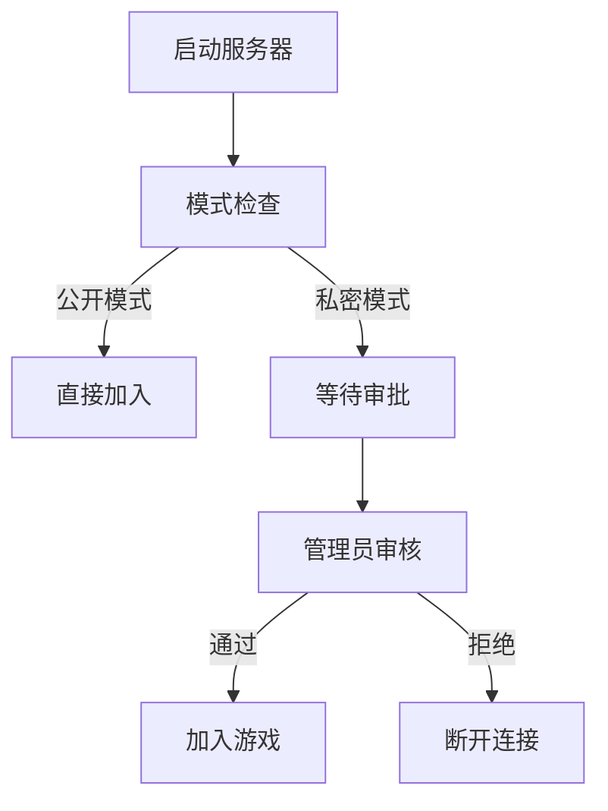

# Strict Mod

**Strict Mod** 是一个为 Minecraft Fabric 设计的模组，旨在通过模组验证、玩家认证和服务器访问控制增强服务器安全性。它确保只有经过授权的玩家和使用允许模组的客户端能够加入服务器，使用加密令牌验证和可配置的模组策略。

## 目录
- [功能概述](#功能概述)
- [主要特性](#主要特性)
- [安装指南](#安装指南)
    - [环境要求](#环境要求)
    - [服务器安装](#服务器安装)
    - [客户端安装](#客户端安装)
- [使用方法](#使用方法)
    - [玩家指南](#玩家指南)
    - [管理员指南](#管理员指南)
- [命令列表](#命令列表)
- [配置说明](#配置说明)
    - [配置文件示例](#配置文件示例)
    - [配置项详解](#配置项详解)
- [技术实现](#技术实现)
    - [客户端-服务器握手](#客户端-服务器握手)
    - [令牌系统](#令牌系统)
    - [模组验证](#模组验证)
    - [访问控制](#访问控制)
    - [流程图](#流程图)
- [代码结构](#代码结构)
- [构建与依赖](#构建与依赖)
- [日志系统](#日志系统)
- [故障排查](#故障排查)
- [未来改进](#未来改进)
- [许可证](#许可证)

## 功能概述

Strict Mod 提供以下核心功能：

- ✅ **模组验证**：强制客户端使用批准的模组，防止作弊或不兼容模组。
- 🔒 **玩家认证**：通过加密令牌验证玩家身份，防止冒充。
- 🛡️ **访问控制**：支持公开和私密服务器模式，私密模式下新玩家需管理员审批。
- ⚠️ **黑名单管理**：按 UUID 或计算机名称封禁玩家。
- ⚙️ **灵活配置**：通过 YAML 配置文件管理模组策略、服务器设置和黑名单。

## 主要特性

| 特性 | 描述 |
|------|------|
| 安全握手 | 客户端与服务器通过 `strict:check` 通道进行双向验证，确保模组和玩家身份合法。 |
| 动态白名单 | 支持实时更新允许/排除的模组列表，兼容 Fabric 模组。 |
| 审批系统 | 私密模式下，管理员可通过点击按钮审批或拒绝新玩家加入。 |
| 加密通信 | 使用 AES-GCM 加密和 SHA-256 哈希保护令牌，防止篡改和重放攻击。 |
| 详细日志 | 记录模组验证、玩家认证和审批事件，便于调试和监控。 |

## 安装指南

### 环境要求

- **Minecraft 版本**：1.21.3（或 `build.gradle` 中指定的兼容版本）
- **Fabric Loader**：0.15.0+（版本在 `build.gradle` 中指定）
- **Fabric API**：1.0+（版本在 `build.gradle` 中指定）
- **Java**：21（在 `build.gradle` 中配置）

### 服务器安装

1. 构建模组：
   ```bash
   ./gradlew build
   ```
2. 复制文件：
   ```bash
   cp build/libs/strict-1.0-SNAPSHOT.jar server/mods/
   cp fabric-api-<version>.jar server/mods/
   ```
3. 启动服务器，首次运行会生成配置文件：
   ```
   config/
   └── strict/
       └── config.yml
   ```
4. 编辑 `config/strict/config.yml` 配置模组策略、密钥等（见 [配置说明](#配置说明)）。

### 客户端安装

1. 安装必要文件：
   ```bash
   cp build/libs/strict-1.0-SNAPSHOT.jar client/mods/
   cp fabric-api-<version>.jar client/mods/
   ```
2. 启动 Minecraft 客户端并连接到运行 Strict Mod 的服务器。
3. 确保客户端模组与服务器的 `allowedMods` 或 `allowFabricMods` 设置匹配。

## 使用方法

### 玩家指南

1. 在客户端安装 Strict Mod 和 Fabric API。
2. 连接到运行 Strict Mod 的服务器，客户端会自动发送模组列表和加密令牌。
3. 若服务器为私密模式且你是新玩家，需等待管理员审批（通过后可再次连接）。
4. 确保只使用服务器允许的模组（查看服务器的 `allowedMods` 或联系管理员）。

### 管理员指南

1. 使用 `/strict` 命令管理服务器（需权限等级 4，即管理员权限）。
2. 监控玩家加入尝试：
    - 公开模式：合法玩家直接加入。
    - 私密模式：新玩家触发审批通知，包含 `[同意]`、 `[拒绝]` 和 `[拉黑]` 按钮。
3. 配置 `config/strict/config.yml` 设置模组白名单、黑名单和服务器模式。
4. 查看日志（`latest.log`）或启用详细日志（`/strict log true`）以调试问题。

## 命令列表

Strict Mod 提供 `/strict` 命令及其子命令，所有命令需要管理员权限（权限等级 4）。

| 命令 | 描述 | 示例 |
|------|------|------|
| `/strict mode public` | 切换到公开模式（无需审批）。 | `/strict mode public` |
| `/strict mode private` | 切换到私密模式（新玩家需审批）。 | `/strict mode private` |
| `/strict log <true/false>` | 启用/禁用详细日志。 | `/strict log true` |
| `/strict accept <player>` | 批准待审批玩家加入。 | `/strict accept dwgx1337` |
| `/strict reject <player>` | 拒绝待审批玩家。 | `/strict reject dwgx1337` |
| `/strict blacklist add <player>` | 按 UUID 和计算机名称拉黑玩家。 | `/strict blacklist add dwgx1337` |
| `/strict blacklist remove <identifier>` | 从黑名单移除玩家。 | `/strict blacklist remove <uuid>` |
| `/strict blacklist list` | 列出黑名单玩家。 | `/strict blacklist list` |
| `/strict info <player>` | 显示玩家信息（模组、UUID、计算机名称等）。 | `/strict info dwgx1337` |
| `/strict mod allow <modId>` | 将模组添加到允许列表。 | `/strict mod allow fabric-api` |
| `/strict mod exclude <modId>` | 将模组添加到排除列表。 | `/strict mod exclude cheatmod` |
| `/strict mod remove <modId>` | 从允许/排除列表移除模组。 | `/strict mod remove fabric-api` |
| `/strict mod allowFabric <true/false>` | 启用/禁用自动允许 Fabric 模组。 | `/strict mod allowFabric false` |
| `/strict mod list` | 列出允许/排除模组及 Fabric 模组策略。 | `/strict mod list` |
| `/strict reload` | 重新加载 `config.yml`。 | `/strict reload` |

**实现**：`com.strict.command.CommandHandler`

## 配置说明

### 配置文件示例

模组使用 YAML 配置文件 `config/strict/config.yml`，由 `com.strict.config.ConfigManager` 管理。首次启动服务器时生成默认配置文件。

```yaml
privateMode: false
logEnabled: true
secretKey: "dwgx1337"
secretKeyHash: ""
allowedMods:
  - minecraft
  - strict
  - fabricloader
  - java
  - mixinextras
  - org_yaml_snakeyaml
excludedMods: []
allowFabricMods: true
blacklistedPlayers: []
```

### 配置项详解

- `privateMode`：启用私密模式，新玩家需管理员审批（默认：`false`）。
- `logEnabled`：启用详细日志，记录模组验证和玩家认证事件（默认：`true`）。
- `secretKey`：用于 AES-GCM 加密和令牌哈希的密钥（默认：`"dwgx1337"`，建议更改）。
- `secretKeyHash`：保留供未来使用（默认：`""`）。
- `allowedMods`：允许的模组 ID 列表（默认：核心模组和依赖项）。
- `excludedMods`：明确禁止的模组 ID 列表（默认：空）。
- `allowFabricMods`：自动允许以 `fabric-` 开头的模组（默认：`true`）。
- `blacklistedPlayers`：黑名单玩家的 UUID 或计算机名称列表（默认：空）。

**实现**：`com.strict.config.ConfigManager`

## 技术实现

Strict Mod 基于客户端-服务器握手模型，通过加密令牌验证和模组列表检查控制访问。以下是关键技术实现的详细说明。

### 客户端-服务器握手

- **目的**：确保客户端运行 Strict Mod，并提供模组列表和玩家数据供服务器验证。
- **流程**：
    1. **服务器发起**：在玩家登录时，服务器通过 `strict:check` 通道发送请求（`ServerLoginConnectionEvents.QUERY_START`）。
    2. **客户端响应**：客户端（`ClientNetworking`）发送 `CheckPayload`，包含：
        - AES-GCM 加密的令牌（包含玩家名称、随机数、时间戳、哈希）。
        - 计算机名称（系统用户名）。
        - 模组列表（过滤掉 `org.yaml.snakeyaml`）。
    3. **服务器验证**：服务器（`ModCheckModule`）解码数据包，解密令牌，验证哈希，检查模组列表和玩家数据。
- **实现**：
    - **客户端**：`com.strict.client.ClientNetworking`
    - **服务器**：`com.strict.module.impl.ModCheckModule`
    - **数据包**：`CheckPayload`（`ModCheckModule` 中的记录）

### 令牌系统

- **目的**：认证客户端，防止令牌重放或篡改。
- **算法**：
    - **令牌结构**：JSON 对象，包含 `playerName`、 `nonce`（UUID）、 `timestamp` 和 `hash`。
    - **加密**：AES-GCM 加密，使用 12 字节 IV 和 16 字节标签，密钥由 `secretKey` 通过 SHA-256 派生。
    - **哈希**：对令牌的明文 JSON（`playerName`、 `nonce`、 `timestamp`）与 `secretKey` 拼接后进行 SHA-256 哈希。
    - **验证流程**：
        1. 使用 AES-GCM 解密令牌。
        2. 解析 JSON，提取 `hash`、 `playerName`、 `nonce`、 `timestamp`。
        3. 从 `playerName`、 `nonce`、 `timestamp` 和 `secretKey` 重新生成哈希。
        4. 比较重新生成的哈希与接收到的 `hash`。
        5. 检查 `nonce` 的唯一性（存储在 `usedNonces` 中，10 分钟过期）和 `timestamp` 的新鲜度（5 分钟内）。
- **安全特性**：
    - **Nonce**：防止重放攻击。
    - **Timestamp**：确保令牌新鲜性。
    - **AES-GCM**：提供机密性和完整性。
    - **SHA-256**：确保令牌真实性。
- **实现**：
    - **加密/解密**：`com.strict.utils.CryptoUtils`（`encryptAES_GCM`、 `decryptAES_GCM`）
    - **哈希/验证**：`CryptoUtils`（`generateToken`、 `verifyToken`）
    - **密钥生成**：`ModCheckModule.generateAesKey`、 `ClientNetworking.generateAesKey`

### 模组验证

- **目的**：确保客户端仅使用批准的模组。
- **算法**：
    1. 客户端发送模组列表（过滤掉 `org.yaml.snakeyaml`）。
    2. 服务器检查每个模组 ID：
        - 是否在 `allowedMods` 中（明确允许）。
        - 若 `allowFabricMods` 为 `true`，是否以 `fabric-` 开头。
        - 是否在 `excludedMods` 中（明确禁止）。
    3. 未通过检查的模组被标记为非法。
    4. 若存在非法模组，客户端断开连接并显示非法模组列表。
- **实现**：
    - **验证逻辑**：`ModCheckModule.getIllegalMods`、 `ModCheckModule.isAllowedMod`
    - **配置**：`ConfigManager.Config`（`allowedMods`、 `excludedMods`、 `allowFabricMods`）

### 访问控制

- **公开模式**：
    - 拥有有效令牌和批准模组的玩家直接加入。
    - 管理员（权限等级 4）绕过检查。
- **私密模式**：
    - 新玩家加入 `pendingPlayers` 并断开，显示“等待管理员审批”。
    - 管理员收到广播，包含 `[同意]`、 `[拒绝]` 和 `[拉黑]` 可点击按钮。
    - 批准的玩家加入 `allowedPlayers`，下次连接通过。
- **黑名单**：
    - 按 UUID 或计算机名称拉黑，立即断开黑名单玩家。
- **实现**：
    - **模式切换**：`ModCheckModule.setPrivateMode`、 `CommandHandler`（`/strict mode`）
    - **审批**：`CommandHandler`（`/strict accept`、 `/strict reject`）
    - **黑名单**：`CommandHandler`（`/strict blacklist`）

### 流程图

以下是 Strict Mod 的访问控制流程图，展示从服务器启动到玩家加入或断开的流程：



**说明**：
- **启动服务器**：服务器加载配置并初始化 Strict Mod。
- **模式检查**：检查 `privateMode` 设置。
- **公开模式**：验证模组和令牌后直接加入。
- **私密模式**：新玩家需管理员审批。
- **管理员审核**：通过 `/strict accept` 或 `/strict reject` 决定玩家是否加入。

**实现**：`ModCheckModule`（握手、验证、审批逻辑），`CommandHandler`（命令处理）。

## 代码结构

| 包 | 类 | 用途 |
|----|----|------|
| `com.strict` | `Main` | 模组入口，初始化服务器端模块。 |
| `com.strict.client` | `ClientNetworking` | 处理客户端网络，发送加密令牌和模组列表。 |
| `com.strict.module.impl` | `ModCheckModule` | 核心服务器逻辑，包括模组验证、令牌验证和访问控制。 |
| `com.strict.config` | `ConfigManager` | 管理 `config.yml` 的加载和保存。 |
| `com.strict.command` | `CommandHandler` | 注册和处理 `/strict` 命令。 |
| `com.strict.utils` | `CryptoUtils` | 提供加密功能（AES-GCM、SHA-256）。 |

## 构建与依赖

模组使用 Gradle 和 Fabric Loom 插件构建。关键依赖包括：
- **Fabric Loader**：用于模组加载。
- **Fabric API**：用于网络和事件处理。
- **SnakeYAML**：用于解析 YAML 配置（使用 `implementation` 避免注册为模组）。

**构建配置**：`build.gradle`
- Java 21
- Fabric Loom 1.10-SNAPSHOT
- 资源处理设置 `duplicatesStrategy = INCLUDE`

**构建命令**：
```bash
./gradlew clean build
```

**输出**：`build/libs/strict-1.0-SNAPSHOT.jar`

## 日志系统

- **服务器日志**：
    - 模组列表：`客户端模组列表: [...]`
    - 配置加载：`成功加载配置文件: allowedMods=[...]`
    - 非法模组：`检测到非法模组: [...]`
    - 玩家加入：`广播玩家加入消息: ...`
    - 审批通知：`广播审批消息: ...`
- **客户端日志**：
    - 令牌发送：`Sending encrypted token: ...`
    - 错误：`Failed to encrypt token: ...`

**控制**：通过 `/strict log <true/false>` 或 `config.yml` 中的 `logEnabled` 启用/禁用。

**查看日志**：
- 服务器：`server/logs/latest.log`
- 客户端：`client/.minecraft/logs/latest.log`

## 故障排查

- **客户端断开连接**：
    - **原因**：非法模组、令牌验证失败或黑名单。
    - **解决**：
        - 检查服务器日志，查看断开原因（例如“非法模组: [...]”）。
        - 确保客户端模组在 `allowedMods` 或符合 `allowFabricMods`。
        - 验证客户端和服务器的 `secretKey` 一致（默认：`dwgx1337`）。
- **管理员无审批通知**：
    - **原因**：权限不足或广播设置错误。
    - **解决**：
        - 确保管理员在 `ops.json` 中具有权限等级 4。
        - 检查 `server.properties` 中的 `broadcast-console-to-ops=true`。
        - 启用 `logEnabled` 查看详细日志。
- **配置未生效**：
    - **原因**：`config.yml` 格式错误或未加载。
    - **解决**：
        - 删除 `config/strict/config.yml`，重启服务器重新生成。
        - 使用 `/strict reload` 重新加载配置。
        - 检查日志中的 `成功加载配置文件` 消息。
- **图标或描述未显示**：
    - **原因**：`fabric.mod.json` 配置错误或资源缺失。
    - **解决**：
        - 确保 `assets/strict/icon.png` 存在于 JAR 中。
        - 验证 `fabric.mod.json` 的 `name`、 `description` 和 `icon` 字段。
        - 清理构建缓存（`./gradlew clean`）并重新构建。

## 未来改进

- **模组过滤**：增强客户端过滤，排除更多 Fabric API 子模块（例如 `fabric-api-base`）。
- **令牌轮换**：实现定期 `secretKey` 轮换，提高安全性。
- **图形界面**：为管理员添加 GUI，简化玩家和模组管理。
- **数据库支持**：使用数据库存储黑名单和批准记录，支持跨服务器持久化。

## 许可证

本模组采用 [MIT 许可证](LICENSE)。详情见 `LICENSE` 文件。